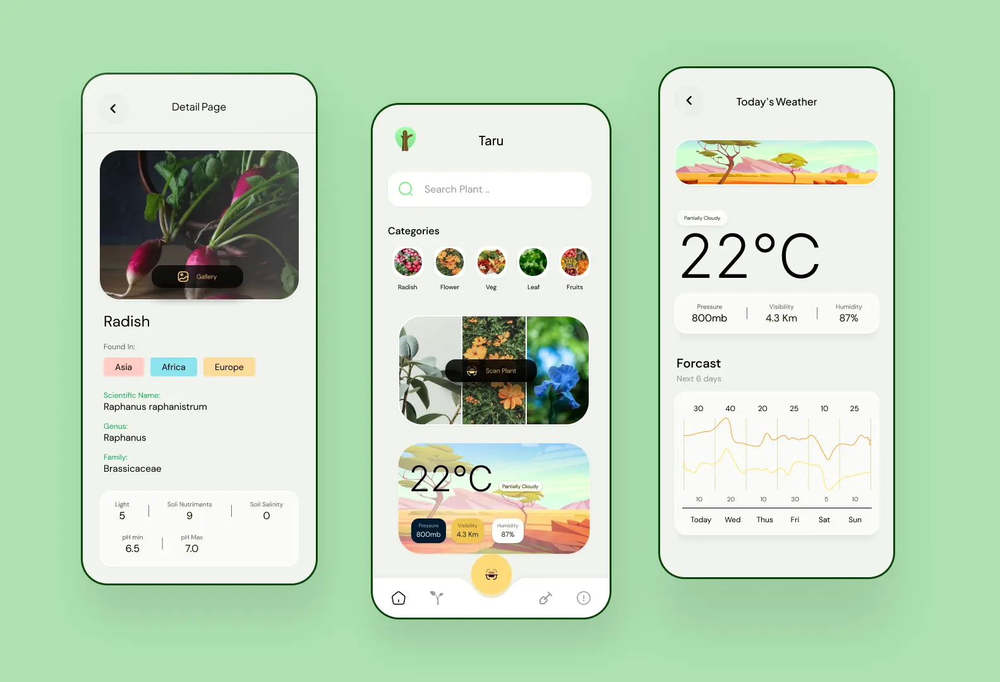
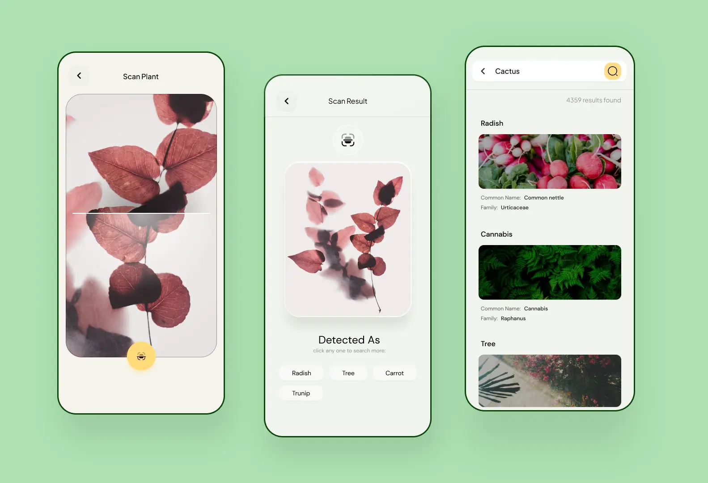

# Plant Buddy : Plants Search with Weather 

[](https://android-arsenal.com/api?level=24)
[](https://android-arsenal.com/api?level=24) 

> Introducing Plant Buddy - the ultimate app for plant lovers! Our Android app is built using MVVM architecture with local caching using Room SQLite Database. With Plant Buddy, you can identify plants, check the weather, and discover new favorites. And the best part? Plant Buddy is completely open source!






## Software Requirements Specification (SRS) Document
SRS for the project is available [here.](https://github.com/uphargaur/Plant-Buddy-App/blob/main/SRS.md)


## Feature Roadmap
- 2023: Insect Detection.
- 2023: Plantation Guidance.


## Setup:
- create `local.properties` file in [root folder](./) if not exists.
- Add `weatherKey`, `trefleKey` and `plantnetKey` in the file as shown below.


```android
...

weatherKey="key here"
trefleKey="key here"
plantnetKey="key here"
```

- Get `weatherKey` from [Open Weather Map](https://openweathermap.org/)
,  `trefleKey` from [Trefle](https://trefle.io/) and `plantnetKey` from [Plantnet](https://my.plantnet.org/)


## Features

The whole functionality is implemented inside the domain folder, where the repository accesses remote and local data from the data folder and provides it to the viewmodel using the Use Case (Clean Architecture).

* Use of open source api.
* Usage of android Data binding.
* MVVM Architecture + Clean architecture.
* Android Room Sqlite Database for local cache.
* Theming in M3 for Light and Dark.


## Tech Stack

This project takes advantage of best practices of common libraryies and tools in android.

* [Kotlin](https://kotlinlang.org/)  
* [Coroutines](https://kotlinlang.org/docs/reference/coroutines-overview.html) - for background operations  
* [Hilt](https://dagger.dev/hilt/) - for dependency injection  
* [Coil](https://github.com/coil-kt/coil) - image loading library
* [Jetpack libraries](https://developer.android.com/jetpack):
   * [Navigation](https://developer.android.com/topic/libraries/architecture/navigation/) - in-app navigation
   * [Lifecycle](https://developer.android.com/topic/libraries/architecture/lifecycle) - perform an action when lifecycle state changes
   * [ViewModel](https://developer.android.com/topic/libraries/architecture/viewmodel) - store and manage UI-related data in a lifecycle conscious way


<br>

## Show your love :heart: by giving a :star: on this project.

<br>

<br>


# Open Source Credits


- [PlantNet](https://identify.plantnet.org/) for plants detection.
- [Trefle](https://trefle.io) is open source plants database.
- [OpenWeatherMap](https://api.openweathermap.org) used of Weather Forecast.


# License

[](LICENSE)

